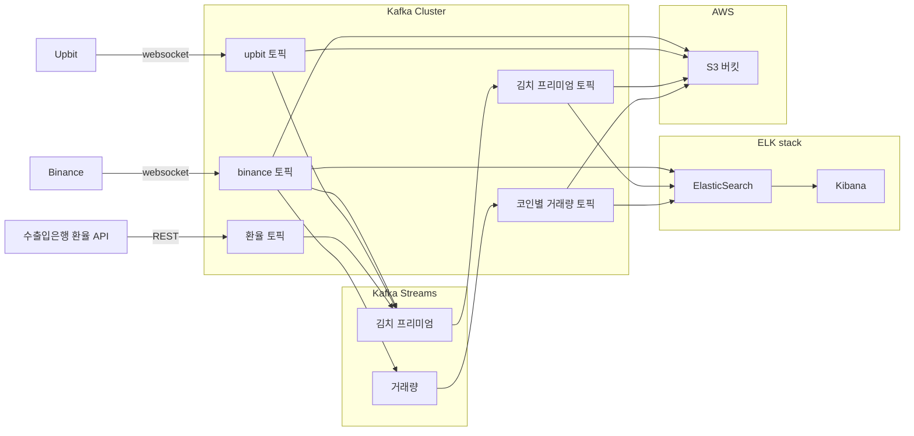

# Alin-Coinboard
비트코인 거래량 / 김치 프리미엄 등 시각화 대시보드

## 팀원
- 20기 백승연
- 20기 서혁준
- 20기 이학민
- 20기 주현경

## 프로젝트 파이프라인

```mermaid
graph LR;

subgraph Kafka Cluster
	T_B[binance 토픽]
	T_U[upbit 토픽]
	T_EX[환율 토픽]
	T_Kim[김치 프리미엄 토픽]
	T_Vol[코인별 거래량 토픽]
end

subgraph ELK stack
	ES[ElasticSearch]
	KB[Kibana]
end

subgraph AWS
	S3[S3 버킷]
end

subgraph Kafka Streams
	S_Kim[김치 프리미엄]
	S_Vol[거래량]
end

%% API Input
B[Binance] --websocket--> T_B
U[Upbit] --websocket--> T_U
E[수출입은행 환율 API] --REST--> T_EX

%% 김치 프리미엄 계산
T_B --> S_Kim
T_U --> S_Kim
T_EX --> S_Kim
S_Kim --> T_Kim

%% 거래량 변화 계산
T_B --> S_Vol
S_Vol --> T_Vol

%% ELK 컨슈머
T_B --> ES
T_Kim --> ES
T_Vol --> ES
ES --> KB

%% S3 컨슈머
T_B --> S3
T_U --> S3
T_Kim --> S3
T_Vol --> S3
```
