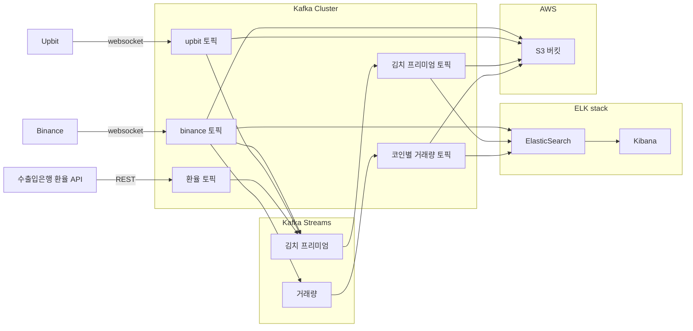

# Alin-Coinboard

비트코인 거래량 / 김치 프리미엄 등 시각화 대시보드

## 팀원

- 20기 백승연
- 20기 서혁준
- 20기 이학민
- 20기 주현경

## 목표

- BTC, BNB, XRP, ETH, DOGE, TRX 코인에 대해서 현재가, 가격 변동 추이, 김치 프리미엄, 거래량 급등 정보를 보여주는 대시보드 구축

## 프로젝트 파이프라인



## 개발환경 셋업 방법

1. `docker-compose` 를 이용한 카프카 개발환경 실행

```bash

# 카프카 클러스터 실행
docker compose up -d

# binance 토픽 데이터 조회 (kafka-console-consumer)
docker compose logs binance-consumer

# upbit 토픽 데이터 조회 (kafka-console-consumer)
docker compose logs upbit-consumer

# kimchi premium 토픽 데이터 조회 (kafka-console-consumer)
docker compose logs kimchi-premium-consumer

# trading volume 토픽 데이터 조회 (kafka-console-consumer)
docker compose logs trading-volume-consumer

# 프로듀서 실행

# Apple Silicon
./producer/bin/start-producer-darwin-arm64

# Apple Intel
./producer/bin/start-producer-darwin-amd64

# Windows
./producer/bin/start-producer-windows-amd64.exe


```
